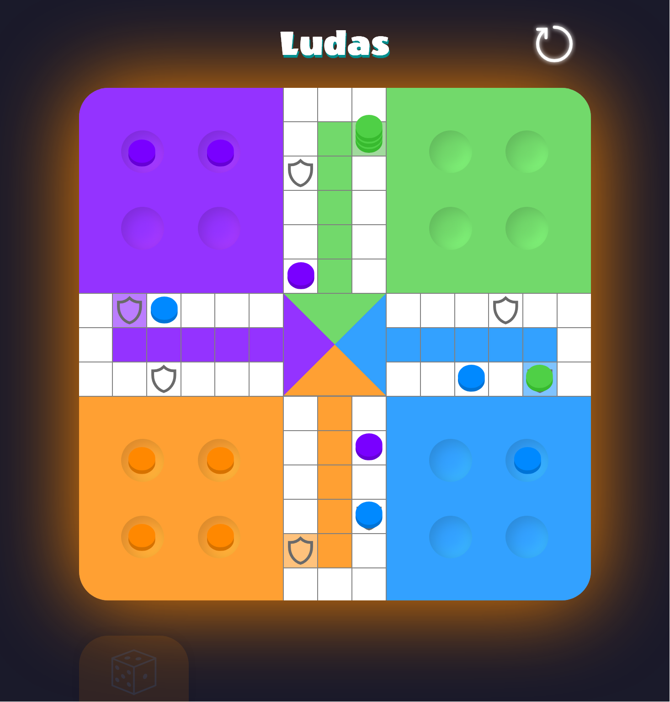

# Ludas - Online Ludo game

**Ludas** is a digital version of the classic **Ludo** board game.

### Play now

Try the game directly online: [Ludas - Play now](https://tordesillas.github.io/Ludas/).

### Features

- **Local multiplayer**: Play with friends on the same device.
- **Play against AI**: Challenge the computer in solo mode.
- **Responsive interface**: Enjoy the game on any device, whether mobile or desktop.
- **Simple and intuitive design**: A smooth experience inspired by the traditional board game.

### Technologies

- **Frontend**: Built with **React**, state management via **Redux**.
- **Build**: Optimized using **Vite** for fast development and build processes.
- **Deployment**: Hosted on **GitHub Pages**, with automated deployments via **GitHub Actions**.
